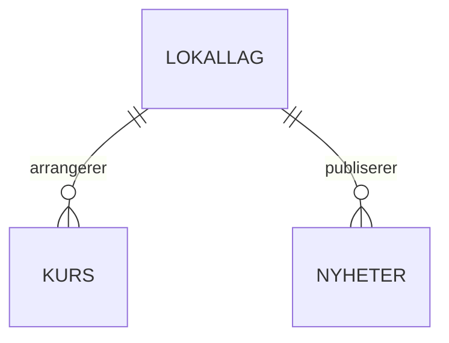

# Datamodell for sprint 1

- **Oppgave:** B03 – Avklare datamodell for sprint 1
- **Arbeidsstatus:** Test / Review
- **Dato:** 8. oktober 2026
- **Til gjennomgang:** Felt, datatyper, obligatoriske verdier og regler nedenfor er et forslag. Endelig godkjenning fra gruppen gjenstår.

## Grunnlag og avgrensning

Kanbanen er gjeldende plan for sprint 1. Den omfatter lokallag, kurs og artikler/nyheter. Den tidligere innleveringen foreslo å utsette lese-API-ene for kurs og nyheter; denne avgrensningen brukes ikke i dette forslaget.

Modellen skal støtte:

- Oversikt og detaljer om lokallag, som beskrevet i B07.
- Publiserte nyheter per lokallag, sortert med nyeste først, og visning av én artikkel, som beskrevet i B08.
- Kommende kurs per lokallag, med detaljer om tidspunkt, sted og pris, som beskrevet i B09.

Spørsmål om medlemskontoer, påmelding og booking dokumenteres her. Implementering av disse funksjonene inngår ikke i den foreslåtte minimumsmodellen for sprint 1. De eksisterende Payload-kontoene brukes til innholdsadministrasjon.

Kilder:

- [Backendoppgaver – sprint 1, kanban](https://docs.google.com/spreadsheets/d/1wb5zZ92pesadyIr7MBeHcgFBE3tIF7P7WtI3FXeXjc4/edit?gid=315543665#gid=315543665), særlig B03 og B06–B09. Lest 8. oktober 2026.
- *Software engineering 14-6.pdf*, tidligere innlevering: datamodell og klassediagram på side 22–24 og sprintavgrensning på side 28–32. PDF-en er delt separat og ligger ikke i dette repositoryet.
- Eksisterende [Payload-konfigurasjon](../Backend/src/payload.config.ts), samlinger og [frontendens medlemsgruppedata](../Frontend/src/pages/medlemsgrupperData.js).

## Begreper og dagens implementering

Lokallag tilsvarer frontendens «medlemsgrupper» i dette forslaget. Artikkel og nyhet er samme innholdstype, lagret i samlingen `nyheter`.

| Område | Finnes i dag | Gjenstår i modellforslaget |
| --- | --- | --- |
| Lokallag | Eksempeldata i frontend | Ny samling `lokallag` og lese-API |
| [Kurs](../Backend/src/collections/Kurs.ts) | `title`, `date`, `description` og valgfri `image`; opprettelse i admin og offentlig lesing | Relasjon til lokallag, sted og pris |
| [Nyheter](../Backend/src/collections/Nyheter.ts) | `title` og `content`; opprettelse i admin og offentlig lesing | Relasjon til lokallag, publiseringsstatus og publiseringstidspunkt |
| [Users](../Backend/src/collections/Users.ts) | Innlogging til Payload-adminpanelet | Egne roller og tilgang per lokallag er ikke implementert |
| [Media](../Backend/src/collections/Media.ts) | Filopplasting med alternativ tekst | Kursbildet er foreløpig en URL som tekst, uten en relasjon til `media` |

Backend bruker Payload med SQLite. MySQL i det tidligere arkitekturbildet samsvarer derfor ikke med dagens implementering. Frontend bruker fortsatt hardkodede eksempeldata.

## Relasjoner

Klassediagrammet i innleveringen legger til grunn at hvert kurs og hver artikkel tilhører nøyaktig ett lokallag. Ett lokallag kan ha null eller flere kurs og artikler.

I Payload foreslås et obligatorisk `relationship`-felt med navnet `lokallag` og `relationTo: 'lokallag'` på både kurs og nyheter. Relasjonen tillater ett lokallag per post. Navn, adresse og kontaktinformasjon til lokallaget lagres i lokallagsposten.

Felles innhold for flere lokallag er ikke modellert. Et eventuelt behov for dette må avklares før relasjonen endres.

## Felles felt

Payload håndterer disse feltene automatisk på alle tre samlingene:

| Felt | Type i API-et | Betydning |
| --- | --- | --- |
| `id` | Tall med dagens SQLite-oppsett | Unik identifikator innenfor samlingen |
| `createdAt` | ISO 8601-tidsstempel | Når posten ble opprettet |
| `updatedAt` | ISO 8601-tidsstempel | Når posten sist ble oppdatert |

Disse feltene skal ikke legges inn manuelt i samlingenes `fields`-lister.

## Lokallag

Foreslått samling: `Lokallag`, med slug `lokallag` og `admin.useAsTitle: 'name'`.

| Felt | Payload-type | Påkrevd | Betydning |
| --- | --- | --- | --- |
| `name` | `text` | Ja | Navn på lokallaget |
| `region` | `text` | Ja | Fylke eller region, etter avtalt navnebruk |
| `description` | `textarea` | Ja | Beskrivelse til oversikt og detaljside |
| `address` | `text` | Nei | Lokallagets adresse |
| `contactEmail` | `email` | Nei | Kontaktadresse for lokallaget |
| `contactPhone` | `text` | Nei | Telefonnummer, inkludert eventuell landskode |

`name`, `region` og `description` matcher eksisterende feltnavn i frontend. Telefonnummer lagres som tekst, slik at blant annet `+47` og mellomrom kan beholdes. Koordinater fra den tidligere modellen kan legges til når kartfunksjonen skal utvikles.

## Kurs

Eksisterende samling: `Kurs`, med slug `kurs` og `admin.useAsTitle: 'title'`.

| Felt | Payload-type | Påkrevd | Betydning |
| --- | --- | --- | --- |
| `title` | `text` | Ja | Kursnavn |
| `description` | `textarea` | Ja | Beskrivelse av kurset |
| `date` | `date` | Ja | Kursets startdato og klokkeslett |
| `location` | `text` | Ja | Sted og nødvendig adresseinformasjon |
| `price` | `number` | Ja | Foreslått pris i øre, som heltall større enn eller lik null |
| `image` | `text` | Nei | URL til kursbildet |
| `lokallag` | `relationship` til `lokallag` | Ja | Lokallaget som arrangerer kurset |

Forslag til regler:

- `date` leveres som ISO 8601-tidsstempel. Brukergrensesnittet viser dato og klokkeslett i `Europe/Oslo`.
- «Kommende kurs» betyr kurs med starttidspunkt lik eller senere enn tidspunktet for forespørselen. Oversikten sorteres med nærmeste kurs først.
- Valutaen er NOK. Med øre som enhet betyr `price: 15000` 150 kroner, og `price: 0` betyr gratis. Manglende pris skal ikke automatisk tolkes som gratis.
- Pris i øre er et forslag som gruppen må godkjenne. Den tidligere innleveringen foreslår en desimaltype fremfor `double`; begge tilnærmingene krever at lagring og API-format avtales tydelig.

Sluttidspunkt, kapasitet, kurstype, koordinater og påmeldingsregler fra den større modellen tas opp når de tilhørende funksjonene planlegges.

## Artikler og nyheter

Eksisterende samling: `Nyheter`, med slug `nyheter` og `admin.useAsTitle: 'title'`.

| Felt | Payload-type | Påkrevd | Betydning |
| --- | --- | --- | --- |
| `title` | `text` | Ja | Artikkelens tittel |
| `content` | `textarea` | Ja | Artikkeltekst som ren tekst i første versjon |
| `lokallag` | `relationship` til `lokallag` | Ja | Lokallaget som publiserer artikkelen |
| `_status` | Payloads standardfelt ved aktivering av utkast | Ja | `draft` eller `published` |
| `publishedAt` | `date` | Ved publisering | Tidspunkt for publisering, brukt til sortering |

Forslag til regler:

- Nye artikler starter som utkast. Bruk Payloads innebygde utkastfunksjon for `_status`, fremfor å opprette et ekstra statusfelt med samme formål.
- `publishedAt` settes ved første publisering. Denne logikken må implementeres; feltet oppstår ikke automatisk ved aktivering av utkast. Vanlige redigeringer endrer `updatedAt`.
- Offentlige besøkende kan lese publiserte artikler. Utkast skal være tilgjengelige for autoriserte redaktører i adminpanelet.
- Offentlige lister sorteres etter `publishedAt`, nyeste først. Samme publiseringsregel skal gjelde både liste- og detaljvisning.

Dagens `read: () => true` må tilpasses når publiseringsflyten innføres. Utkast, publiseringsdato og denne tilgangsregelen er foreløpig ikke implementert. Forfatterkobling, artikkelbilder, bildebeskjæring og Facebook-deling fra den større modellen vurderes i senere arbeid.

## Tilgang og API-avtale

Lokallagsinformasjon, kurs og publiserte nyheter skal kunne leses uten innlogging. Opprettelse, endring og sletting skal kreve innlogging og nødvendige rettigheter. Dagens standardoppsett skiller ikke mellom ulike roller eller lokallag for innloggede brukere; det må avklares før slike begrensninger innføres.

B06 må konkretisere API-adresser, JSON-eksempler, filtrering, sortering, paginering og feilsvar. Følgende forskjeller mellom prototypen og frontend må tas med:

- Payloads lister returnerer poster i `docs`, sammen med informasjon om paginering.
- Frontendens eksempeldata bruker tekst-ID-er, blant annet `oslo`, mens dagens database genererer tall-ID-er. Klienten må bruke ID-ene fra API-et og håndtere at URL-parametere er tekst.
- Datoer kommer som ISO-tidsstempler, mens dagens eksempeldata har ferdig formatert norsk datotekst.
- En relasjon kan leveres som ID eller som et objekt, avhengig av API-spørringens `depth`. B06 må velge en forutsigbar representasjon.
- Prisens enhet og format må fremgå av API-eksemplene.

## Åpne spørsmål

| Område | Avklaring som gjenstår |
| --- | --- |
| Brukerkontoer | Skal besøkende og medlemmer ha konto, eller bare administratorer? |
| Roller og lokallag | Hvilke roller trengs? Skal en administrator kunne redigere ett eller flere lokallag? |
| Påmelding | Kreves konto, eller tillates påmelding uten konto? Hvilke opplysninger er nødvendige? |
| Kurskapasitet | Hvordan håndteres deltakergrense, venteliste, duplikater og avmelding? |
| Deltakeropplysninger | Hvor lenge skal opplysningene lagres, og hvem skal ha tilgang? |
| Intern booking | Hva kan bookes, og trenger lokaler en egen samling? Hvordan håndteres overlappende reservasjoner? |
| Sletting av lokallag | Skal sletting sperres når lokallaget har kurs eller artikler, eller skal innholdet kunne flyttes først? |

Den tidligere modellen gir et utgangspunkt for senere arbeid: En påmelding kobler én bruker til ett kurs, og en booking kobles til én bruker og ett lokallag. Detaljene må avklares før implementering. Spørsmål om funksjoner utenfor sprint 1 kan stå åpne når B03 ferdigstilles, så lenge de er dokumentert og avgrensningen er tydelig.

## Gjennomgang og videre arbeid

Før B03 flyttes fra Test / Review til Ferdig, skal gruppen:

- [ ] Bekrefte at lokallag, kurs og nyheter er riktig omfang for sprint 1.
- [ ] Godkjenne relasjonene og feltene, inkludert hvilke verdier som er obligatoriske.
- [ ] Avklare prisformatet og reglene for publisering og tidspunkt.
- [ ] Gjennomgå de åpne spørsmålene og angi hvilke som utsettes til senere arbeid.
- [ ] Registrere hvem som har gjennomgått modellen og eventuelle endringer, og gjøre dokumentet tilgjengelig for gruppen.

| Gjennomgått av | Dato | Resultat eller nødvendige endringer |
| --- | --- | --- |
| Ikke registrert | – | Avventer gruppens gjennomgang |

Godkjente modellvalg brukes videre i B04, database og migrasjoner, og B06, API-avtalen. Før nye relasjoner og obligatoriske felt innføres, må det planlegges hvordan eksisterende testposter får gyldige verdier. Repeterbare fiktive testdata hører til B05.

Dokumentet beskriver et forslag under gjennomgang. Det oppdaterer ikke samlingene i kode eller statusen i det eksterne kanbanarket.
